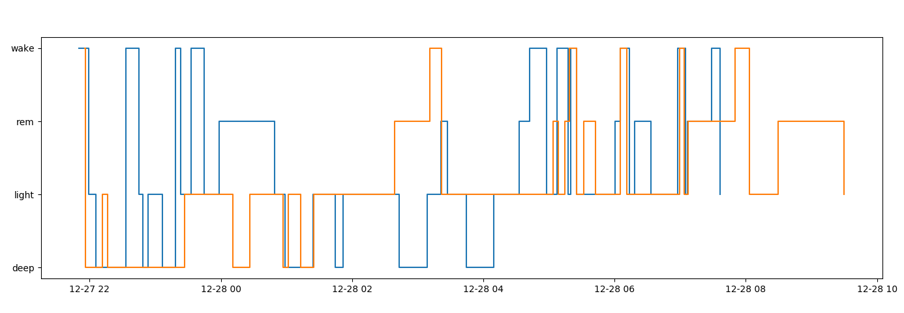

# FitByte

**Plot shared activities**



This repo contains a collection of scripts to make plots from Fitbit data of multiple users.

## Usage

Register an app for the Fitbit API


```bash
pip install -r requirements.txt
python gather_keys_oauth2.py <id> <secret> # repeat for each user
python plot_sleep.py yyyy-mm-dd

```
